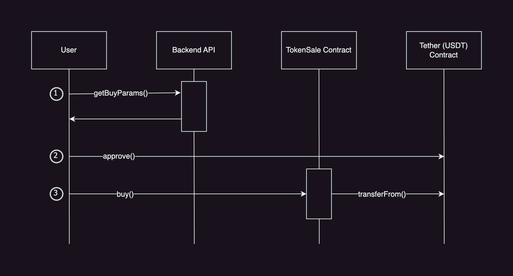
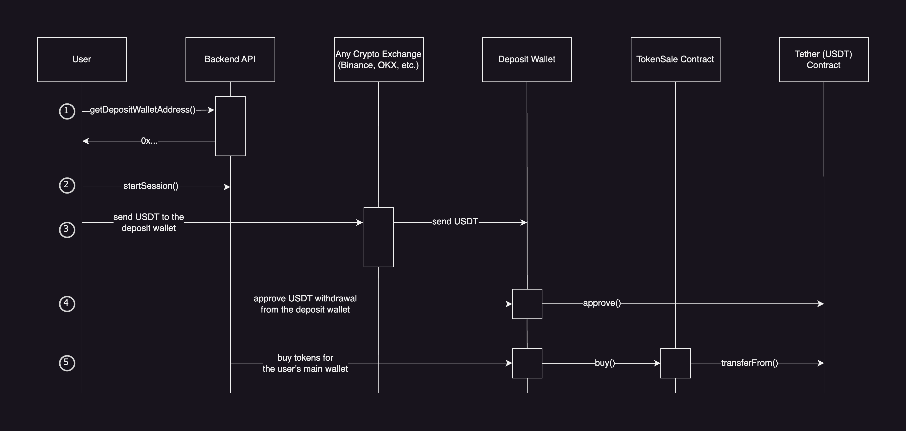
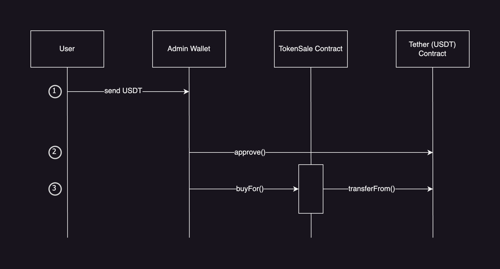

# TokenSale Contract

The main purpose of the contract is to provide an ERC-20 token presale functionality before the actual ERC-20 token is launched.

[API Doc](api/TokenSale.md)

The TokenSale contract supports three main use cases:

- User buys tokens using their personal wallet (user pays the gas fees)
- User buys tokens by transferring USDT to a special "deposit wallet" (the system pays the gas fees instead of the user)
- User sends USDT to the contract's admin wallet address, then the admin buys tokens for the user (admin pays the gas fees)

The contract implements the [EIP-712: Typed structured data hashing and signing](https://eips.ethereum.org/EIPS/eip-712) standard that is used for the first 2 use cases described above. The backend API produces and signs the params sent to one of the contract's functions later and the contract verifies that the params have not been tampered with.

## Case 1: User buys tokens using their personal wallet

It's the most common case for purchasing tokens. The user must have both MATIC and USDT on their personal wallet to make a purchase.

1. User calls the `getBuyParams()` method on the backend. The method accepts the amount of tokens the user wants to buy, calculates the discount and the referral reward, and returns the params the user has to send to the contract's `buy()` function.
2. User approves the USDT withdrawal from their wallet.
3. User calls the `buy()` function on the TokenSale contract. It transfers USDT from the user's account to the treasury wallet. If a referral user reward is present in the params, a certain amount of USDT will be held on the contract until that user withdraws it.

## Case 2: User buys tokens by transferring USDT to a special "deposit wallet"

This is a more simple scenario for most users. In this case users do not pay for the transaction fees in MATIC, they only need to transfer USDT to a special "deposit wallet" that gets automatically created for them after registration on our website. The backend then purchases tokens on their behalf.

1. User fetches their personal deposit wallet address from the backend API.
2. User presses the "Start Session" button on the website. The backend starts watching the deposit wallet's USDT balance.
3. User transfers USDT to the deposit wallet (usually using some crypto exchange platform).
4. Backend approves USDT withdrawal from the deposit wallet. Also, some amount of MATIC may be transferred to the deposit wallet before this step if the wallet is "empty".
5. Backend calculates all the discounts and referral rewards and buys tokens for the user's main wallet.

NOTE: The backend may take an up to 0.2 USDT fee for covering the transaction fees.
NOTE: Purchases for less than 1 USDT are ignored in this flow.

## Case 3: User sends USDT to the contract's admin wallet address, then the admin buys tokens for the user

This scenario assumes a direct communication between a user and an administrator. The user sends USDT to the administrator's wallet, then the administrator purchases tokens on the user's behalf.

1. User contract the admin and transfers USDT to their wallet.
2. Admin approves the USDT withdrawal from their account.
3. Admin buys tokens for the user by calling the `buyFor` function on the TokenSale contract. In this scenario the admin can set an arbitrary discount for the purchase (up to 10%), but the referral program is not available.
